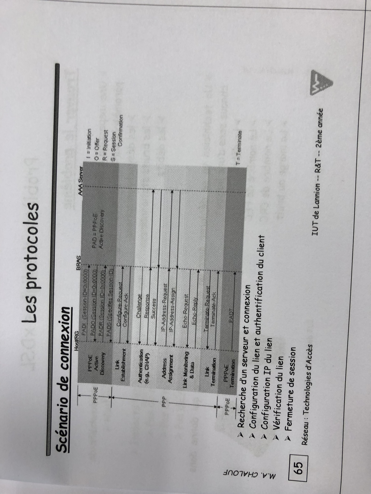
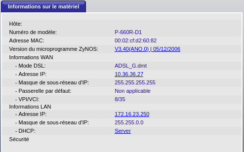
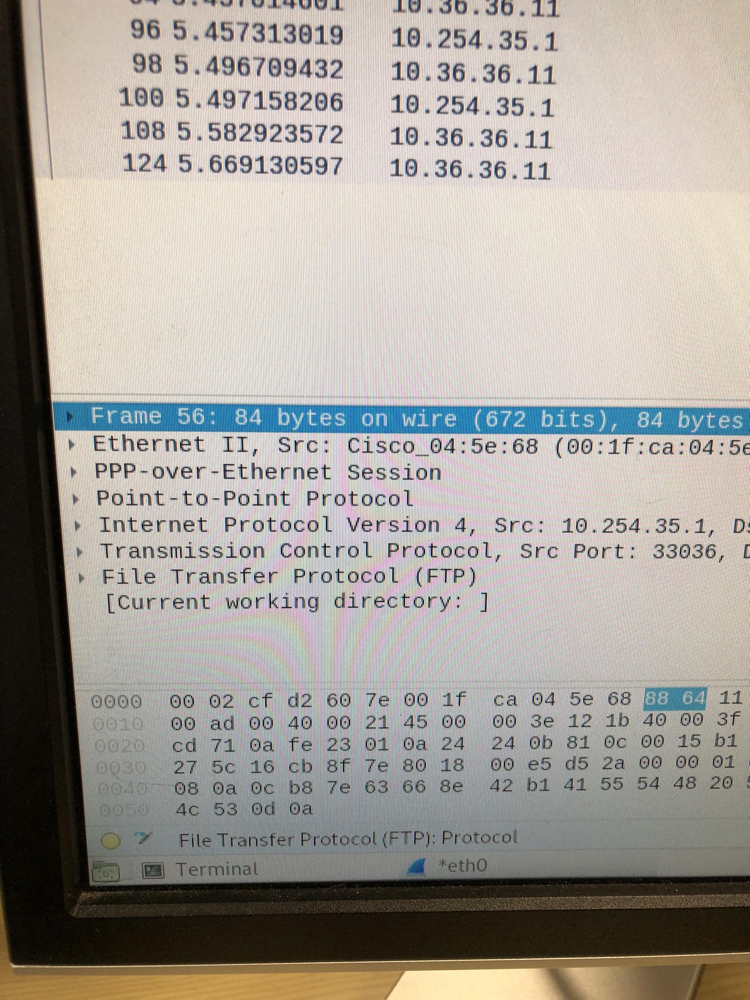

La distance max admissible est d'environ 5.5Km, 

### Étapes PPPoE

PPPoE comporte deux étapes : la phase de découverte et la phase de session PPPoE. À l’étape de la découverte, le client découvre le concentrateur d’accès en identifiant l’adresse MAC (Media Access Control) Ethernet du concentrateur d’accès et en établissant un ID de session PPPoE. Au cours de la phase de session PPPoE, le client et le concentrateur d’accès établissent une connexion point à point via Ethernet, basée sur les informations collectées à l’étape de la découverte.

REMARQUE : 

Si vous configurez un nom de concentrateur d’accès spécifique sur le client et que le même serveur de noms de concentrateur d’accès est disponible, une session PPPoE est établie. En cas d’incompatibilité entre les noms des concentrateurs d’accès du client et du serveur, la session PPPoE est fermée.

Si vous ne configurez pas le nom du concentrateur d’accès, la session PPPoE commence par utiliser un serveur disponible sur le réseau.

-   [Étape de découverte PPPoE](https://www.juniper.net/documentation/fr/fr/software/junos/interfaces-ethernet/topics/topic-map/pppoe-interfaces.html#interfaces-pppoe-overview__d91600e102)
-   [Étape de session PPPoE](https://www.juniper.net/documentation/fr/fr/software/junos/interfaces-ethernet/topics/topic-map/pppoe-interfaces.html#interfaces-pppoe-overview__d91600e132)

#### Étape de découverte PPPoE

Un routeur de services lance l’étape de découverte PPPoE en diffusant un paquet d’initiation à la découverte active PPPoE (PEPP). Pour fournir une connexion point à point sur Ethernet, chaque session PPPoE doit apprendre l’adresse MAC Ethernet du concentrateur d’accès et établir une session avec un ID de session unique. Étant donné que le réseau peut avoir plusieurs concentrateurs d’accès, l’étape de découverte permet au client de communiquer avec chacun d’entre eux et d’en sélectionner un.

REMARQUE : 

Un routeur de services ne peut pas recevoir de paquets PPPoE à partir de deux concentrateurs d’accès différents sur la même interface physique.

La phase de découverte PPPoE se compose des étapes suivantes :

1.  INITIATION ACTIVE DISCOVERY PPPoE (DHCP) : le client lance une session en diffusant un paquet DHCP sur le réseau local pour demander un service.
    
2.  OFFRE DE DÉCOUVERTE ACTIVE PPPoE (PADO) : tout concentrateur d’accès capable de fournir le service demandé par le client dans le paquet DHCP répond avec un paquet PADO qui le contient lui-même, l’adresse unicast du client et le service demandé. Un concentrateur d’accès peut également utiliser le paquet PADO pour offrir d’autres services au client.
    
3.  REQUÊTE PADR (Active Discovery Request) PPPoE : à partir des PADO qu’il reçoit, le client sélectionne un concentrateur d’accès en fonction de son nom ou des services proposés et lui envoie un paquet PADR pour indiquer le service ou les services nécessaires.
    
4.  PPPoE Active Discovery Session-Confirmation (PADS) : lorsque le concentrateur d’accès sélectionné reçoit le paquet PADR, il accepte ou rejette la session PPPoE.
    
    -   Pour accepter la session, le concentrateur d’accès envoie au client un paquet PADS avec un ID de session unique pour une session PPPoE et un nom de service qui identifie le service sous lequel il accepte la session.
        
    -   Pour rejeter la session, le concentrateur d’accès envoie au client un paquet PADS contenant une erreur de nom de service et remet l’ID de session à zéro.
        

#### Étape de session PPPoE

L’étape de session PPPoE commence après l’étape de découverte PPPoE. Le concentrateur d’accès peut démarrer la session PPPoE après avoir envoyé le paquet PADS au client, ou le client peut commencer la session PPPoE après avoir reçu un paquet PADS du concentrateur d’accès. Un routeur de services prend en charge plusieurs sessions PPPoE sur chaque interface, mais pas plus de 256 sessions PPPoE sur toutes les interfaces du routeur de services.

Chaque session PPPoE est identifiée de manière unique par l’adresse Ethernet de l’pair et l’ID de session. Une fois la session PPPoE établie, les données sont envoyées comme dans toute autre encapsulation PPP. Les informations PPPoE sont encapsulées dans une trame Ethernet et envoyées à une adresse unicast. À ce stade, le client et le serveur doivent allouer des ressources pour l’interface logique PPPoE.

Une fois la session établie, le client ou le concentrateur d’accès peut envoyer un paquet PADT (Active Discovery Termination) PPPoE à tout moment pour mettre fin à la session. Le paquet PADT contient l’adresse de destination de l’pair et l’ID de session de la session à terminer. Une fois ce paquet envoyé, la session est fermée au trafic PPPoE.

### Authentification CHAP en option

Pour les interfaces avec l’encapsulation PPPoE, vous pouvez configurer des interfaces pour prendre en charge le protocole CHAP (Handshake Authentication Protocol) du défi PPP. Lorsque vous activez le protocole CHAP sur une interface, celle-ci peut authentifier son pair et être authentifiée par son pair.

Si vous configurez une interface pour gérer uniquement les paquets CHAP entrants (en incluant l’instruction `passive` au niveau de la `[edit interfaces interface-name ppp-options chap]` hiérarchie), l’interface ne défie pas son pair. Toutefois, si l’interface est contestée, elle répond au défi. Si vous n’incluez pas l’instruction `passive` , l’interface défie toujours son pair.

