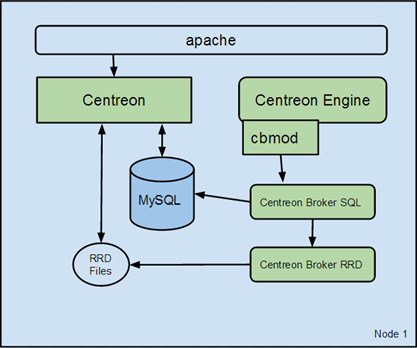
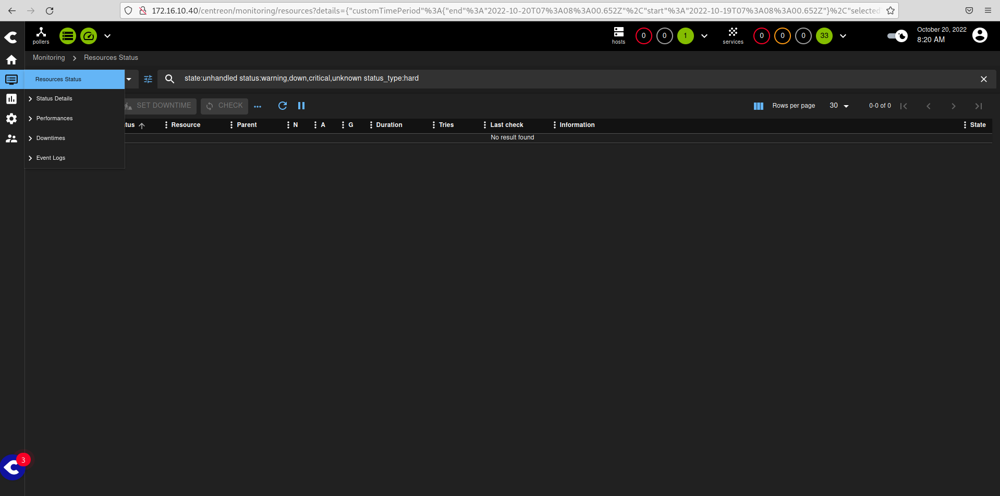
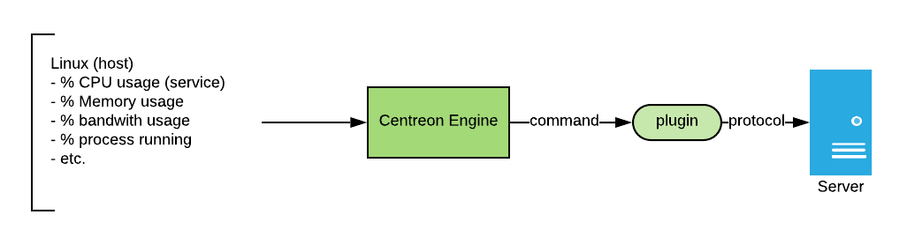

# 1. Supervision avec Centreon

**Faire un compte rendu par binôme de toutes les actions réalisées**

Vous devez recupérer le fichier de ce sujet (ENT) au format Markdown (.md) avec le dossier images et l'éditer avec VSCode afin d'y mettre vos réponses dans un cadre et les captures écran en dessous.

```markdown
Pour le compte rendu sous VSCode :
-- Créez un dossier CR_ETU1_ETU2 qui contient le fichier CR_ETU1_ETU2.md et le sous dossier images
-- mettez les commentaires entre ```
-- Mettez votre texte en gras, il suffit de mettre **Autour du texte**
-- sortez les images (captures écran) des ``` 
-- changez le thème de VSCode : File -> Preferences -> Color Theme --> Light+
-- prévisualisez le résultat : se positioner dans fenêtre du fichier .md  puis CTRL+SHIFT+V  
   ou bien pour avoir le texte et la prévisualisation côte à côte  : CTRL+SHIFT+P  et sélectioner Markdown : Open preiew to the side
```

**Déposer un zip du dossier qui contient le fichier md et les images**

**Ce TP peut être réalisé sur l'ESXi ou l'appliance ou VMWare Workstation**

# 2. Présentation de Centreon

Centreon est un outil de supervision et de monitoring possédant de nombreuses fonctionnalités.
C'est un programme modulaire qui se décompose en plusieurs parties :

* L'ordonnanceur qui se charge d'ordonnancer les tâches de supervision
* Une interface Web
* Les plugins

Il permet de connaître à l’aide de son interface web et en temps réel l’état des périphériques supervisés, comme par exemple :

* Utilisation de la RAM
* Utilisation du processeur
* L’espace disque
* La communication sur le réseau
* Surveillance des services
* Notification par email
* Journalisation des évènements
* Etc.

La liste des possibilités est longue.

Centreon utilise SNMP pour faire l’interrogation des équipements, il faut s’assurer que le matériel à superviser soit configuré correctement (snmp activé, l’ip de centreon autorisé et communauté SNMP de configurée).

Il est également possible de faire des checks par « rebond » via le protocole SSH.

La mise en supervision se fait en deux temps, en premier il faut créer l’hôte (Host) et ensuite ajouter les capteurs (Services).

# 3. Architecture simple

Une architecture est appelée simple lorsqu’on associe tous les modules de Centreon dans un unique serveur.
A noter toutefois que ce type d’architecture comporte de nombreux inconvénients :

* En cas de perte du serveur, on perd toute vues de supervision possibles car tous les modules sont dans le même serveur.
* Les agents envoyant les informations vers un point unique du réseau, la bande passante risque de saturer très rapidement en fonction du nombre d'hôtes supervisés dans l'infrastructure.

**Exemple d’un schéma d’une architecture dite simple**



# 4. Premier pas avec Centreon

Prenez rapidement connaissance du document suivant, nous exploiterons certaines parties après l'installation.

[Premiers pas](https://docs.centreon.com/fr/docs/getting-started/installation-first-steps/)

# 5. Installer un serveur central depuis une VM

[Suivez la procédure pour installer un serveur central depuis une VM] (<https://docs.centreon.com/fr/docs/installation/installation-of-a-central-server/using-virtual-machines/>)

**On télécharge depuis imageStore la VM**
```bash
scp etudiant@172.16.16.1:/REPERTOIRE/DU/FICHIER /DATA/OVF/CENTREON

#Remarque: nous le téléchargeons directement sur notre partage NFS
```

**On importe le fichier OVA depuis VSphere**
```
Selectionner un hôte du cluster -> Clique droit: déployer un modèle OVF -> On indique le répertoire de l'OVF
```

* Mettez une IP statique sur l'interface de votre réseau privé et testez l'accès depuis une VM graphique de votre réseau privé (cf TP1, VM disponible sur 172.16.16.1)
* Mettez une interface NAT (pour permettre les éventuelles mises à jour via le réseau...)

**/!\ Il faut ajouter une carte réseau depuis Vsphere**
```
Type de la carte: VMXENT3
```

**Pour configurer le clavier**
```bash
loadkeys fr
#Remarque: Effet temporaire

localectl set-keymap fr
#Remarque: Effet permanent
```

**Configuration du reseau sur le switch : Vswitch0**
```bash
ip addr add 172.16.10.40/16 dev ens32
ip route add default via 172.16.0.1
#Remarque: L'interface peut se clear et on perd la configuration réseau
```
**Configuration du timezone**
```bash
timedatectl set-timezone Europe/Paris
```
**On configure l'hostname**
```
hostnamectl set-hostname votre-hostname
```
**Creation de la base de donnée MariaDB**
```bash
su - centreon
/bin/php /usr/share/centreon/cron/centreon-partitioning.php
```
**Application des paramètres**
```bash
systemctl restart cbd centengine gorgoned
```

**Connexion à l'interface web d'administration**


[En cas de soucis avec le clavier](https://www.it-connect.fr/passer-le-clavier-en-azerty-sur-centos-7-rhel-7/)

# 6. Superviser un serveur Linux

## 6.1 Superviser votre premier hôte

[Principe de base de la supervision](https://docs.centreon.com/fr/docs/getting-started/first-supervision/)



## 6.2 Configurer Centreon

[Suivez la procédure](https://docs.centreon.com/fr/docs/getting-started/monitor-linux-server-with-snmp/)

## 6.3 Configurer le serveur à superviser via SNMP

* Installez un agent SNMP sur Debian (sur la VM graphique précédente ou une autre). Vous étudierez plus en détail le protocole SNMP au cours de l'année.

```bash
apt install snmpd
#Remarque: la VM peut 'freeze'
```

* Sauvegardez le fichier de configuration de départ.

```
cp /etc/snmp/snmpd.conf /etc/snmp/snmpd.conf.save
```

Editez le pour y ajouter ces lignes :

```
rocommunity macommunaute @IP_SERVEUR_CENTREON # renseigne la communauté et l’ip du serveur centreon
```

Vérifiez depuis le serveur Centreon que le client SNMP est accessible

```
snmpwalk -v 2c -c macommunaute #ip_machine#
```

[En cas de problème, attention au pare feu Debian](https://www.it-connect.fr/configurer-un-pare-feu-local-sous-debian-11-avec-ufw/)

## 6.4 Déployer la configuration

[La procédure impose de déployer la configuration](https://docs.centreon.com/fr/docs/monitoring/monitoring-servers/deploying-a-configuration/)

# 7. Superviser un routeur Cisco

[Superviser un routeur Cisco](https://docs.centreon.com/fr/docs/getting-started/monitor-cisco-router-with-snmp/)

# 8. Superviser un serveur Web

[Superviser un serveur Web](https://docs.centreon.com/fr/docs/monitoring/basic-objects/services-create/)

# 9. Superviser une base de données MariaDB

[Superviser une base de données MariaDB](https://docs.centreon.com/fr/docs/getting-started/monitor-mysql-server/)


[Ce document est mis à disposition selon les termes de la Licence Creative Commons Attribution - Pas d'Utilisation Commerciale - Pas de Modification 4.0 International](http://creativecommons.org/licenses/by-nc-nd/4.0/)

 IUT Lannion © 2022 by R&T is licensed under CC BY-NC-ND 4.0
