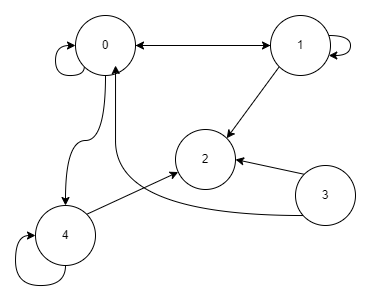

##### Timaï SELMI 21/10/2022
# Partie 1
## Exercice 1
### Graphs 1
- Ordre: 6
- Taille: 7
$$
M1 =
\begin{pmatrix}
0 & 0 & 0 & 0 & 0 & 0 \\ 
0 & 1 & 0 & 0 & 0 & 0 \\ 
1 & 0 & 0 & 0 & 0 & 0 \\ 
0 & 1 & 0 & 0 & 0 & 1 \\
0 & 0 & 0 & 1 & 0 & 0
\end{pmatrix}
$$
### Graphs 2
- Ordre: 6
- Taille: 7
$$
M2 =
\begin{pmatrix}
0 & 1 & 0 & 1 & 0 & 0 \\ 
1 & 0 & 0 & 0 & 0 & 1 \\ 
0 & 0 & 0 & 0 & 0 & 0 \\ 
1 & 0 & 0 & 1 & 0 & 0 \\ 
1 & 0 & 0 & 0 & 0 & 1 \\ 
0 & 1 & 0 & 0 & 1 & 0 \\ 
\end{pmatrix}
$$
## Exercice 2
$$
M3=
\begin{pmatrix}
1 & 1 & 0 & 0 & 1 \\
1 & 1 & 1 & 0 & 0  \\ 
0 & 0 & 0 & 0 & 0 \\ 
0 & 0 & 1 & 0 & 1 \\ 
0 & 0 & 1 & 0 & 1
\end{pmatrix}
$$
1) C'est un graphe orienté, nous avons aucune symétrie sur l'axe de la diagonale.
2) L'ordre est de **5** , sa taille est de 10 arrêtes.
3) Le sommet **3** n'a pas de successeurs ni de prédécesseurs. 
**Graphs sagittale de M3**


# Partie 2
## Fonction qui renvoie l'ordre  et taille d'un graph
A partir de la matrice adjacente, la fonctionne retourne l'ordre du graph.

**Déterminer l'ordre de la matrice**
```python
def get_ordre(matrice: np.array) -> int:

    """
    Fonction permettant de déterminer l'odre d'une matrice adjacente

    Args:

        matrice (numpy): Matrice adjacente du graph

    Returns:

        int: Nombre de l'odre

    """
    # On récupère l'odre avec la méthode shape de la librairie
    res: tuple = np.shape(matrice)

    return res[0]

# TEST de la fonction avec la matrice 3 du sujet:
if get_ordre(M3) == 5:
        print("TEST ORDRE OK")
# SORTIE d'execution = TEST ORDRE OK
```

**Déterminer la taille de la matrice**
```python
def get_taille(matrice: np.array) -> int:

    """
    Fonction permettant de déterminer la taille d'une matrice adjacente
    
    Args:

        matrice (np.array): Matrice adjacente
        
    Returns:
        int: taille
    """
    compteur: int = 0

    # On parcours les lignes
    for ligne in matrice:
        # ajout de la sommes des 1 de la ligne dans le compteur
        compteur += sum(ligne)

    return compteur
# Test de la fonction avec la matrice 3 du sujet
if get_taille(M3) == 10:
        print("TEST TAILLE OK")
# SORTIE d'execution: TEST TAILLE OK
```

**Cherche voisinage**
```python
def cherche_voisin(matrice: np.array, sommets: List[int]) -> bool:

    """
    Fonction vérifiant si les sommets sont voisins

    Args:
        matrice (np.array): matrice
        sommets (List[int]): Contient la liste des deux sommets à vérifier le voisinage

    Returns:
        bool: Si voisin, alors retourne True
    """
    # Voisins
    voisinA: int = sommets[0]
    voisinB: int = sommets[1]
    
    test: bool = False
    
    if matrice[voisinA][voisinB] == 1 or matrice[voisinB][voisinA] == 1:
        test = True

    return test
# TEST DE LA FONCTION
if cherche_voisin(M3, [1, 1]) and not cherche_voisin(M3, [2, 1]):
        print("TEST VOISIN: OK")
# SORTIE d'execution: TEST VOISIN OK
```

**Cherche le successeur**
```python
def cherche_successeur(matrice: np.array, sommet) -> List[int]:
    """
    Fonction retournant une liste des successeurs du sommet: sommet
    Args:
        matrice (np.array): matrice
        sommet (_type_): sommet où on détermine les successeurs
    Returns:

        List[int]: Si aucun successeur, alors liste vide

    """
    res: list = []
    ligne: List = matrice[sommet]

    # Iteration
    for i in range(len(ligne)):
        if ligne[i] == 1:
            res.append(i)

    return res
# TEST DE LA FONCTION
if cherche_successeur(M3, 1) == [0, 1, 2]:
        print("TEST SUCCESSEUR OK")
# SORTIE d'execution: TEST SUCCESSEUR OK      
```

**Cherche le prédécesseur**
```python
def cherche_predecesseur(matrice: np.array, sommet: int) -> List[int]:

    """

    Fonction retournant une liste de predecesseur du sommet: sommet

  

    Args:

        matrice (np.array): Matrice

        sommet (int): sommet où on détermine les prédécesseurs

  

    Returns:

        Liste[int]: Si aucun prédécesseur, alors liste vide

    """
    res: List = []
    colonne: List = matrice[:, sommet]

    for i in range(len(colonne)):
        if colonne[i] == 1:
            res.append(i)

    return res
# TEST DE LA FONCTION    
if cherche_predecesseur(M3, 2) == [1, 3, 4]:
        print("TEST PREDECESSEUR: OK")
# SORTIE d'exectuion: TEST PREDECESSEUR: OK
```

**Cherche sans prédécesseur**
```python
def cherche_no_predecesseur(matrice: np.array) -> List[int]:

    """
    Fonction cherchant tous les sommets sans prédécesseur et retourne une liste

    Args:

        matrice (np.array): Matrice

    Returns:

        List[int]: Liste d'indice des sommets sans prédécesseurs
    """

    res: List = []
    for ligne in range(len(matrice)):
        if sum(matrice[ligne]) == 0:
            res.append(ligne)

    return res
# TEST DE LA FONCTION
if cherche_no_predecesseur(M3) == [2]:
        print("TEST NO PREDECESSEUR: OK")
# SORTIE d'execution: TEST NO PREDECESSEUR: OK
```

**Cherche réflexif**
```python
def cherche_reflexif(matrice: np.array) -> bool:
    """
    Test si la matrice est reflexif, chaque sommet possède une boucle

    Args:
        matrice (np.array): Matrice

    Returns:

        bool: Si chaque sommet a une boucle, alors retourne True
    """

    test: bool = False
    sommeDiagonnale: int = len(matrice) # Sommes des diagonales
    diagonale: List = np.matrix.diagonal(matrice) # On récupère la diagonnale

    res = sommeDiagonnale == sum(diagonale)

    return res
# TEST FONCTION
if cherche_reflexif(M3) != True:
        print("TEST REFLEXIF: OK")
# SORTIE d'execution: TEST REFLEXIF: OK
```