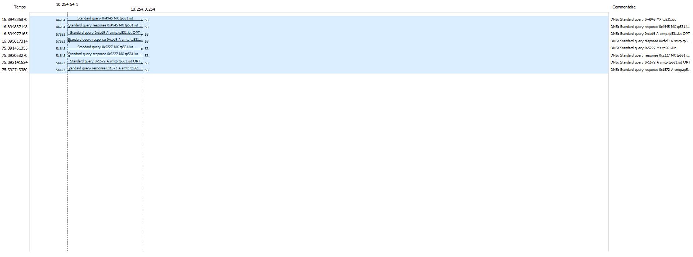
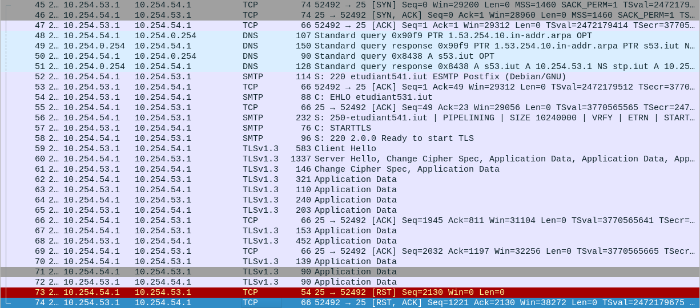

# Configuration de base
Les scripts ``init_machine.sh`` mettent en place les adresses IP.

Sur *Sn* nous devons activer le routage:
```
echo 1 > /proc/sys/net/ip/ip_forward
```

**Test de connectivité, remise directe, puis STP**:
```
root@D54:~# ping -c 3 10.54.1.1

PING 10.54.1.1 (10.54.1.1) 56(84) bytes of data.
64 bytes from 10.54.1.1: icmp_seq=1 ttl=64 time=0.265 ms
64 bytes from 10.54.1.1: icmp_seq=2 ttl=64 time=0.190 ms
64 bytes from 10.54.1.1: icmp_seq=3 ttl=64 time=0.326 ms

--- 10.54.1.1 ping statistics ---

3 packets transmitted, 3 received, 0% packet loss, time 2031ms
rtt min/avg/max/mdev = 0.190/0.260/0.326/0.055 ms

root@D54:~# ping -c 3 10.254.0.254

PING 10.254.0.254 (10.254.0.254) 56(84) bytes of data.
64 bytes from 10.254.0.254: icmp_seq=1 ttl=63 time=0.551 ms
64 bytes from 10.254.0.254: icmp_seq=2 ttl=63 time=0.729 ms
64 bytes from 10.254.0.254: icmp_seq=3 ttl=63 time=0.502 ms

--- 10.254.0.254 ping statistics ---

3 packets transmitted, 3 received, 0% packet loss, time 2031ms
rtt min/avg/max/mdev = 0.502/0.594/0.729/0.097 ms
root@D54:~#
```

**DNS & Wireshark**
On vérifie le bon fonctionnement du DNS, après avoir modifier le fichier *resolv.conf*
```
nameserver 10.254.0.254
```

Test avec la commande dig:
```
root@D54:~# dig s54.tp541.iut

  
; <<>> DiG 9.16.27-Debian <<>> s54.tp541.iut
;; global options: +cmd
;; Got answer:
;; ->>HEADER<<- opcode: QUERY, status: NOERROR, id: 48719
;; flags: qr aa rd ra; QUERY: 1, ANSWER: 2, AUTHORITY: 1, ADDITIONAL: 2
 

;; OPT PSEUDOSECTION:
; EDNS: version: 0, flags:; udp: 4096
;; QUESTION SECTION:
;s54.tp541.iut.         IN  A

;; ANSWER SECTION:
s54.tp541.iut.      86400   IN  A   10.254.54.1
s54.tp541.iut.      86400   IN  A   10.54.1.1

  
;; AUTHORITY SECTION:
tp541.iut.      86400   IN  NS  stp.iut.

;; ADDITIONAL SECTION:
stp.iut.        15  IN  A   10.254.0.254

;; Query time: 0 msec
;; SERVER: 10.254.0.254#53(10.254.0.254)
;; WHEN: Mon Nov 07 12:57:45 CET 2022
;; MSG SIZE  rcvd: 108
```

Observation capture wireshark:
```
Frame 1: 96 bytes on wire (768 bits), 96 bytes captured (768 bits) on interface eth0, id 0
Ethernet II, Src: HewlettP_c0:4f:68 (18:a9:05:c0:4f:68), Dst: D-Link_b1:60:c8 (5c:d9:98:b1:60:c8)
Internet Protocol Version 4, Src: 10.54.2.2, Dst: 10.254.0.254
User Datagram Protocol, Src Port: 46678, Dst Port: 53
Domain Name System (query)
    Transaction ID: 0x6556
    Flags: 0x0120 Standard query
    Questions: 1
    Answer RRs: 0
    Authority RRs: 0
    Additional RRs: 1
    Queries
        s54.tp541.iut: type A, class IN
    Additional records
    [Response In: 2]
```

La réponse:
```
Frame 2: 150 bytes on wire (1200 bits), 150 bytes captured (1200 bits) on interface eth0, id 0
Ethernet II, Src: D-Link_b1:60:c8 (5c:d9:98:b1:60:c8), Dst: HewlettP_c0:4f:68 (18:a9:05:c0:4f:68)
Internet Protocol Version 4, Src: 10.254.0.254, Dst: 10.54.2.2
User Datagram Protocol, Src Port: 53, Dst Port: 46678
Domain Name System (response)
    Transaction ID: 0x6556
    Flags: 0x8580 Standard query response, No error
    Questions: 1
    Answer RRs: 2
    Authority RRs: 1
    Additional RRs: 2
    Queries
        s54.tp541.iut: type A, class IN
    Answers
        s54.tp541.iut: type A, class IN, addr 10.254.54.1
        s54.tp541.iut: type A, class IN, addr 10.54.1.1
    Authoritative nameservers
    Additional records
    [Request In: 1]
    [Time: 0.000907518 seconds]
```

**Analyse des dossiers & fichiers**
Observation */etc/postfix/*
```
root@D54:/var/spool/postfix# ls -l
total 64
drwx------ 2 postfix root     4096  5 mars   2020 active
drwx------ 2 postfix root     4096  5 mars   2020 bounce
drwx------ 2 postfix root     4096  5 mars   2020 corrupt
drwx------ 2 postfix root     4096  5 mars   2020 defer
drwx------ 2 postfix root     4096  5 mars   2020 deferred
drwxr-xr-x 2 root    root     4096  7 nov.  12:41 dev
drwxr-xr-x 2 root    root     4096 15 janv.  2020 etc
drwx------ 2 postfix root     4096  5 mars   2020 flush
drwx------ 2 postfix root     4096  5 mars   2020 incoming
drwxr-xr-x 2 root    root     4096 15 janv.  2020 lib
drwx-wx--T 2 postfix postdrop 4096  5 mars   2020 maildrop
drwxr-xr-x 2 root    root     4096  5 mars   2020 pid
drwx------ 2 postfix root     4096  5 mars   2020 private
drwx--s--- 2 postfix postdrop 4096  5 mars   2020 public
drwx------ 2 postfix root     4096  5 mars   2020 saved
drwxr-xr-x 3 root    root     4096  5 mars   2020 usr
root@D54:/var/spool/postfix#
```

- **maildropt**: contient les messages locaux
- **incoming**: contient les messages qui ont été prélevé dans maildrop par le daemond pickup, puis traiter par daemond cleanup. Il sert aussi de file d'attente pour les mails non traité par qmgr
- **active**: file d'attente des messages en cours de délivrance par qmgr
- **defered**; mail non transmis

On génère notre fichier de configuration:
```
dpkg-reconfigure postfix
```

On remplit les champs:
**Site internet**: il faut que le server s'intègre au réseau mondial
**nom du courriel**: tp541.iut.
On met les 3 réseaux qu'on va écouter

**Fichier de configuration de main.cfg**
```
root@S54:/etc/postfix# cat main.cf

# See /usr/share/postfix/main.cf.dist for a commented, more complete version

# Debian specific:  Specifying a file name will cause the first

# line of that file to be used as the name.  The Debian default

# is /etc/mailname.
#myorigin = /etc/mailname
smtpd_banner = $myhostname ESMTP $mail_name (Debian/GNU)
biff = no
# appending .domain is the MUA's job.
append_dot_mydomain = no
# Uncomment the next line to generate "delayed mail" warnings

#delay_warning_time = 4h
readme_directory = no
# See http://www.postfix.org/COMPATIBILITY_README.html -- default to 2 on
# fresh installs.
compatibility_level = 2
# TLS parameters
smtpd_tls_cert_file=/etc/ssl/certs/ssl-cert-snakeoil.pem
smtpd_tls_key_file=/etc/ssl/private/ssl-cert-snakeoil.key
smtpd_tls_security_level=may
smtp_tls_CApath=/etc/ssl/certs
smtp_tls_security_level=may
smtp_tls_session_cache_database = btree:${data_directory}/smtp_scache  

smtpd_relay_restrictions = permit_mynetworks permit_sasl_authenticated defer_unauth_destination
myhostname = s54
alias_maps = hash:/etc/aliases
alias_database = hash:/etc/aliases
myorigin = /etc/mailname
mydestination = $myhostname, tp541.iut., s54, localhost.localdomain, localhost
relayhost =
mynetworks = 10.254.0.0/16 10.54.1.0/24 10.54.2.0/24
mailbox_size_limit = 0
recipient_delimiter =
inet_interfaces = all
inet_protocols = ipv4
```

**Version de postfix**
```
root@S54:/etc/postfix# postconf mail_version
mail_version = 3.5.6
```

**Vérification du fichier de configuration**
```
root@S54:/etc/postfix# /etc/init.d/postfix check
postfix/postfix-script: warning: symlink leaves directory: /etc/postfix/./makedefs.out
root@S54:/etc/postfix#
```
*Le warning n'est pas une erreur fatale*

**Fichier logs utiles**
```
root@S54: ls /var/log

mail.info
syslog
```

# Création de comptes & aliases
Dans le fichier /etc/aliases, il y a une redirection de postmaster vers root, c'est qui est interdit.

**On crée un utilisateur**
```
root@S54:~# useradd etudiant
root@S54:~# passwd etudiant
Nouveau mot de passe :
Retapez le nouveau mot de passe :
passwd: password updated successfully
```

On vérifie que notre utilisateur existe bien dans le fichier *passwd*
```
root@S54:~# tail -n 1 /etc/passwd
etudiant:x:1001:1001::/home/etudiant:/bin/sh
```
``-n`` permet d'indiquer le nombre de lignes

On ajoute à la fin du fichier */etc/aliases* :
```
postamster: root
root: etudiant
```

Vérification:
L'heure à bien changée sur le fichier /etc/aliases
```
ls -l /etc/aliases
-rw-r--r-- 1 root root 68  7 nov.  14:52 /etc/aliases
```

Mais pas sur le fichier de base de donnée
```
ls -l /etc/aliases.db
-rw-r--r-- 1 root root 12288  7 nov.  14:23 /etc/aliases.db
```

On va écrire un mail avec l'utilitaire *mail*:
```
$ mail root
Cc: 
Subject: Test
Bonjour
```

Il faut faire *CRTL+D* pour ajouter le caractère EOT, et envoyer.

On reçoit bien le mail:
```
$ mail
"/var/mail/etudiant": 1 message 1 nouveau
>N   1 etudiant@s54       lun. nov.  7 15:  13/367   Test
? 
Return-Path: <etudiant@s54>
X-Original-To: root@s54
Delivered-To: root@s54
Received: by tp541.iut (Postfix, from userid 1001)
	id 487538062A; Mon,  7 Nov 2022 15:10:33 +0100 (CET)
To: <root@s54>
Subject: Test
X-Mailer: mail (GNU Mailutils 3.10)
Message-Id: <20221107141033.487538062A@tp541.iut>
Date: Mon,  7 Nov 2022 15:10:33 +0100 (CET)
From: etudiant@s54

Bonjour
? 
Pas de message applicable
? 
```

Le compte étudiant à reçu le mail, car l'aliase *root: etudiant* permet de rediriger tous les mails allant vers **root** vers l'utilisateur **etudiant**.

**On vérifie dans les logs**
```
root@S54:/var/log# tail -n 10 syslog
Nov  7 15:09:01 s54 CRON[235921]: (root) CMD (  [ -x /usr/lib/php/sessionclean ] && if [ ! -d /run/systemd/system ]; then /usr/lib/php/sessionclean; fi)
Nov  7 15:09:10 s54 systemd[1]: Starting Clean php session files...
Nov  7 15:09:10 s54 systemd[1]: phpsessionclean.service: Succeeded.
Nov  7 15:09:10 s54 systemd[1]: Finished Clean php session files.
Nov  7 15:10:33 s54 postfix/pickup[235834]: 487538062A: uid=1001 from=<etudiant@s54>
Nov  7 15:10:33 s54 postfix/cleanup[235988]: 487538062A: message-id=<20221107141033.487538062A@tp541.iut>
Nov  7 15:10:33 s54 postfix/qmgr[235835]: 487538062A: from=<etudiant@s54>, size=302, nrcpt=1 (queue active)
Nov  7 15:10:33 s54 postfix/local[235990]: 487538062A: to=<etudiant@tp541.iut>, orig_to=<root@s54>, relay=local, delay=0.29, delays=0.26/0.01/0/0.03, dsn=2.0.0, status=sent (delivered to mailbox)
Nov  7 15:10:33 s54 postfix/qmgr[235835]: 487538062A: removed
Nov  7 15:17:01 s54 CRON[236005]: (root) CMD (   cd / && run-parts --report /etc/cron.hourly)
root@S54:/var/log#
```

**Envoie depuis le compte étudiant**
```
root@S54:~# mail etudiant@s54
Cc: 
Subject: Test3
Oups

$ mail
"/var/mail/etudiant": 3 messages 3 nouveaux
>N   1 etudiant@s54       lun. nov.  7 15:  13/367   Test
 N   2 root               lun. nov.  7 15:  13/383   Test2
 N   3 root               lun. nov.  7 15:  13/373   Test3
? 3
Return-Path: <root@s54>
X-Original-To: etudiant@s54
Delivered-To: etudiant@s54
Received: by tp541.iut (Postfix, from userid 0)
	id 110F08062B; Mon,  7 Nov 2022 15:26:58 +0100 (CET)
To: <etudiant@s54>
Subject: Test3
X-Mailer: mail (GNU Mailutils 3.10)
Message-Id: <20221107142659.110F08062B@tp541.iut>
Date: Mon,  7 Nov 2022 15:26:58 +0100 (CET)
From: root <root@s54>
Oups

root@S54:~/Documents# 
```

```
root@S54:~# ls /var/spool/mail
etudiant  root
```
Le champs **To**: détermine la destination

# Les labels pour les comptes email
On ajoute un label:
```
root@S54:~# tail -n 1 /etc/passwd
etudiant:x:1001:1001:Toto:/home/etudiant:/bin/sh
```

On envoie un email pour vérifier l'application des labels:
```
root@S54:~# mail etudiant
Cc: 
Subject: TEST54
azerty
```

On vérifie la réception depuis l'utilisateur *etudiant*
```
$ mail
"/var/mail/etudiant": 9 messages 9 nouveaux
>N   1 etudiant@s54       lun. nov.  7 15:  13/367   Test
 N   2 root               lun. nov.  7 15:  13/383   Test2
 N   3 root               lun. nov.  7 15:  13/373   Test3
 N   4 root               lun. nov.  7 15:  13/373   TEst 4
 N   5 etudiant@s54       lun. nov.  7 15:  13/362   001
 N   6 Thomas             lun. nov.  7 15:  13/378   Tst53
 N   7 Mail Delivery Syst lun. nov.  7 15:  70/2029  Undelivered Mail Returned to Sender
 N   8 Mail Delivery Syst lun. nov.  7 15:  70/2029  Undelivered Mail Returned to Sender
 N   9 Thomas             lun. nov.  7 15:  13/378   TEST54
? 9
Return-Path: <root@s54>
X-Original-To: etudiant@s54
Delivered-To: etudiant@s54
Received: by tp541.iut (Postfix, from userid 0)
	id B95598062C; Mon,  7 Nov 2022 15:47:40 +0100 (CET)
To: <etudiant@s54>
Subject: TEST54
X-Mailer: mail (GNU Mailutils 3.10)
Message-Id: <20221107144740.B95598062C@tp541.iut>
Date: Mon,  7 Nov 2022 15:47:40 +0100 (CET)
From: Thomas <root@s54>

azerty

```

# Mail vers l'extérieur
On écrit à notre voisin:
```
$ mail etudiant@tp531.iut
Cc: 
Subject: Test test test
tttttttttteeeeeeeeeeeesssssssssssttttttttt
```

On regarde notre la boite mail *etudiant*:
```
$ mail
"/var/mail/etudiant": 11 messages 11 nouveaux
>N   1 etudiant@s54       lun. nov.  7 15:  13/367   Test
 N   2 root               lun. nov.  7 15:  13/383   Test2
 N   3 root               lun. nov.  7 15:  13/373   Test3
 N   4 root               lun. nov.  7 15:  13/373   TEst 4
 N   5 etudiant@s54       lun. nov.  7 15:  13/362   001
 N   6 Thomas             lun. nov.  7 15:  13/378   Tst53
 N   7 Mail Delivery Syst lun. nov.  7 15:  70/2029  Undelivered Mail Returned to Sender
 N   8 Mail Delivery Syst lun. nov.  7 15:  70/2029  Undelivered Mail Returned to Sender
 N   9 Thomas             lun. nov.  7 15:  13/378   TEST54
 N  10 Nicholas Latifi    lun. nov.  7 15:  16/624   Calendrier
 N  11 root dupont        lun. nov.  7 15:  16/615   I love u
```

**Capture Wireshark**



On observe bien une requête pour la ressource **MX** de la zone *tp531.iut*

```
Frame 36: 69 bytes on wire (552 bits), 69 bytes captured (552 bits) on interface eth0, id 0
Ethernet II, Src: HewlettP_ff:04:66 (80:c1:6e:ff:04:66), Dst: Dell_e0:fc:04 (00:15:c5:e0:fc:04)
Internet Protocol Version 4, Src: 10.254.54.1, Dst: 10.254.0.254
User Datagram Protocol, Src Port: 44784, Dst Port: 53
Domain Name System (query)
    Transaction ID: 0x4945
    Flags: 0x0100 Standard query
    Questions: 1
    Answer RRs: 0
    Authority RRs: 0
    Additional RRs: 0
    Queries
        tp531.iut: type MX, class IN
    [Response In: 37]
```

La réponse:
```
Frame 37: 124 bytes on wire (992 bits), 124 bytes captured (992 bits) on interface eth0, id 0
Ethernet II, Src: Dell_e0:fc:04 (00:15:c5:e0:fc:04), Dst: HewlettP_ff:04:66 (80:c1:6e:ff:04:66)
Internet Protocol Version 4, Src: 10.254.0.254, Dst: 10.254.54.1
User Datagram Protocol, Src Port: 53, Dst Port: 44784
Domain Name System (response)
    Transaction ID: 0x4945
    Flags: 0x8580 Standard query response, No error
    Questions: 1
    Answer RRs: 1
    Authority RRs: 1
    Additional RRs: 1
    Queries
        tp531.iut: type MX, class IN
    Answers
        tp531.iut: type MX, class IN, preference 0, mx smtp.tp531.iut
    Authoritative nameservers
        tp531.iut: type NS, class IN, ns stp.iut
    Additional records
        stp.iut: type A, class IN, addr 10.254.0.254
    [Request In: 36]
    [Time: 0.000601278 seconds]
```

*Lors de la capture, nous avons eu des envoies de mails par les voisins sur notre serveur.*

Le paramètre *inet_interfaces* : indique toutes les adresses d'interface réseau sur lesquelles le système Postfix doit écouter.

---
**Configuration que S54 est à la fois serveur SMTP et DNS**
Configuration de postfix *main.cf*:
```
# See /usr/share/postfix/main.cf.dist for a commented, more complete version

# Debian specific:  Specifying a file name will cause the first
# line of that file to be used as the name.  The Debian default
# is /etc/mailname.
#myorigin = /etc/mailname

smtpd_banner = $myhostname ESMTP $mail_name (Debian/GNU)
biff = no

# appending .domain is the MUA's job.
append_dot_mydomain = no

# Uncomment the next line to generate "delayed mail" warnings
#delay_warning_time = 4h

readme_directory = no

# See http://www.postfix.org/COMPATIBILITY_README.html -- default to 2 on
# fresh installs.
compatibility_level = 2


# TLS parameters
smtpd_tls_cert_file=/etc/ssl/certs/ssl-cert-snakeoil.pem
smtpd_tls_key_file=/etc/ssl/private/ssl-cert-snakeoil.key
smtpd_tls_security_level=may

smtp_tls_CApath=/etc/ssl/certs
smtp_tls_security_level=may
smtp_tls_session_cache_database = btree:${data_directory}/smtp_scache

smtpd_relay_restrictions = permit_mynetworks permit_sasl_authenticated defer_unauth_destination
myhostname = etudiant541.iut
alias_maps = hash:/etc/aliases
alias_database = hash:/etc/aliases
myorigin = /etc/mailname
mydestination = $myhostname, etudiant541.iut, s54, localhost.localdomain, localhost
relayhost = 
mynetworks = 10.254.0.0/16 10.54.1.0/24 10.54.2.0/24
mailbox_size_limit = 0
recipient_delimiter = 
inet_interfaces = all
inet_protocols = ipv4
```

On déclare les deux nouvelles zones:
```
// prime the server with knowledge of the root servers
zone "poste54.etudiant.iut." {
    type master;
    file "/etc/bind/meszones/db.poste54.etudiant.iut";
    allow-transfer {10.54.112.1 ;};
    forwarders {0.0.0.0 ;};
};

zone "212.54.10.in-addr.arpa" {
    type master;
    file "/etc/bind/meszones/db.212.54.10";
    allow-transfer {10.54.112.1 ;};
    allow-query {10.54.212.0/24 ; };
};

zone "112.54.10.in-addr.arpa" {
    type master;
    file "/etc/bind/meszones/db.112.54.10";
    allow-transfer {10.54.112.1 ;};
};

zone "etudiant541.iut" {
    type master;
    file "/etc/bind/meszones/db.etudiant541.iut";
};

zone "etudiant531.iut" {
    type master;
    file "/etc/bind/meszones/db.etudiant531.iut";
};
```

Première zone:
```
$ORIGIN etudiant541.iut.
; BIND data file for local loopback interface
;
$TTL    604800
@   IN  SOA etudiant541.iut. etudiant541.iut. (
                  2     ; Serial
             604800     ; Refresh
              86400     ; Retry
            2419200     ; Expire
             604800 )   ; Negative Cache TTL
;
@   IN  NS  S54.etudiant541.iut.
S54 IN  A   10.254.54.1
G54 IN  A   10.54.1.3
D54 IN  A   10.54.2.2
smtp    IN      A       10.254.54.1
@   IN  MX  10  smtp.etudiant541.iut.
1   IN  PTR S54.etudiant541.iut.
```

Seconde zone:
```
$ORIGIN etudiant531.iut.
; BIND data file for local loopback interface
;
$TTL    604800
@   IN  SOA etudiant541.iut. etudiant541.iut. (
                  2     ; Serial
             604800     ; Refresh
              86400     ; Retry
            2419200     ; Expire
             604800 )   ; Negative Cache TTL
;
@   IN  NS  S54.etudiant541.iut.
S54 IN  A   10.254.54.1
smtp    IN      A       10.254.53.1
@   IN  MX  10  smtp.etudiant531.iut.
1   IN  PTR S53.etudiant531.iut.
```

**On vérifie que les fichiers sont corrects:**
```
root@S54:/etc/bind/meszones# named-checkzone etudiant541.iut db.etudiant541.iut
zone etudiant541.iut/IN: loaded serial 2
OK

root@S54:/etc/bind/meszones# named-checkzone etudiant531.iut db.etudiant531.iut
zone etudiant531.iut/IN: loaded serial 2
OK

root@S54:/etc/bind/# named-checkconf named.conf.default-zones
OK
```

**Capture Wireshark de la résolution de nom**
Pour *etudiant541.iut* requête & réponse
```
Frame 1: 103 bytes on wire (824 bits), 103 bytes captured (824 bits) on interface eth0, id 0
Ethernet II, Src: HewlettP_c0:4f:68 (18:a9:05:c0:4f:68), Dst: D-Link_b1:60:c8 (5c:d9:98:b1:60:c8)
Internet Protocol Version 4, Src: 10.54.2.2, Dst: 10.54.2.1
User Datagram Protocol, Src Port: 34242, Dst Port: 53
Domain Name System (query)
    Transaction ID: 0x9413
    Flags: 0x0120 Standard query
    Questions: 1
    Answer RRs: 0
    Authority RRs: 0
    Additional RRs: 1
    Queries
        smtp.etudiant541.iut: type A, class IN
    Additional records
    [Response In: 2]
```

réponse:
```
Frame 2: 135 bytes on wire (1080 bits), 135 bytes captured (1080 bits) on interface eth0, id 0
Ethernet II, Src: D-Link_b1:60:c8 (5c:d9:98:b1:60:c8), Dst: HewlettP_c0:4f:68 (18:a9:05:c0:4f:68)
Internet Protocol Version 4, Src: 10.54.2.1, Dst: 10.54.2.2
User Datagram Protocol, Src Port: 53, Dst Port: 34242
Domain Name System (response)
    Transaction ID: 0x9413
    Flags: 0x8580 Standard query response, No error
    Questions: 1
    Answer RRs: 1
    Authority RRs: 0
    Additional RRs: 1
    Queries
        smtp.etudiant541.iut: type A, class IN
    Answers
        smtp.etudiant541.iut: type A, class IN, addr 10.254.54.1
    Additional records
    [Request In: 1]
    [Time: 0.000551537 seconds]
```

Pour *etudiant541.iut*:
```
Frame 7: 103 bytes on wire (824 bits), 103 bytes captured (824 bits) on interface eth0, id 0
Ethernet II, Src: HewlettP_c0:4f:68 (18:a9:05:c0:4f:68), Dst: D-Link_b1:60:c8 (5c:d9:98:b1:60:c8)
Internet Protocol Version 4, Src: 10.54.2.2, Dst: 10.54.2.1
User Datagram Protocol, Src Port: 48527, Dst Port: 53
Domain Name System (query)
    Transaction ID: 0x234d
    Flags: 0x0120 Standard query
    Questions: 1
    Answer RRs: 0
    Authority RRs: 0
    Additional RRs: 1
    Queries
        smtp.etudiant531.iut: type A, class IN
    Additional records
    [Response In: 8]
```

La réponse:
```
Frame 8: 135 bytes on wire (1080 bits), 135 bytes captured (1080 bits) on interface eth0, id 0
Ethernet II, Src: D-Link_b1:60:c8 (5c:d9:98:b1:60:c8), Dst: HewlettP_c0:4f:68 (18:a9:05:c0:4f:68)
Internet Protocol Version 4, Src: 10.54.2.1, Dst: 10.54.2.2
User Datagram Protocol, Src Port: 53, Dst Port: 48527
Domain Name System (response)
    Transaction ID: 0x234d
    Flags: 0x8580 Standard query response, No error
    Questions: 1
    Answer RRs: 1
    Authority RRs: 0
    Additional RRs: 1
    Queries
        smtp.etudiant531.iut: type A, class IN
    Answers
        smtp.etudiant531.iut: type A, class IN, addr 10.254.53.1
    Additional records
    [Request In: 7]
    [Time: 0.000584432 seconds]
```

Envoie mail
```
$ mail etudiant@etudiant541.iut    
Cc:
Subject: Test
QERTY
$ mail
```

Dans les fichiers de logs
```
Nov 15 15:05:58 s54 kernel: [ 5269.326924] device eth0 entered promiscuous mode
Nov 15 15:06:25 s54 postfix/pickup[10941]: C9C2E8062F: uid=0 from=<root@s54>
Nov 15 15:06:25 s54 postfix/cleanup[11082]: C9C2E8062F: message-id=<20221115140625.C9C2E8062F@etudiant541.iut>
Nov 15 15:06:25 s54 postfix/qmgr[10942]: C9C2E8062F: from=<root@s54>, size=336, nrcpt=1 (queue active)
Nov 15 15:06:26 s54 postfix/smtp[11084]: C9C2E8062F: to=<etudiant@etudiant531.iut>, relay=smtp.etudiant531.iut[10.254.53.1]:25, delay=0.38, delays=0.23/0.01/0.07/0.06, dsn=2.0.0, status=sent (250 2.0.0 Ok: queued as 6E1A08053D)
```

Nous avons bien le serveur mail relay de *etudiant431.iut*

**Capture Wireshark**

On observe que les données sont biens envoyées, avec le "*Transfert DATA*" mais aussi qu'il y a bien eu entre les deux serveurs un *SYN/ACK*. La présence de *EHLO* nous indique que le client se présente à *smtp.etudiant531.iut* et qu'il y a bien une présentation comme indiquer dans la RFC

Réception mail:


On observe bien un *SYN/ACK* avec le serveur *smtp.etudiant531.iut* , le transfert des données et la fermeture de la connexion.

